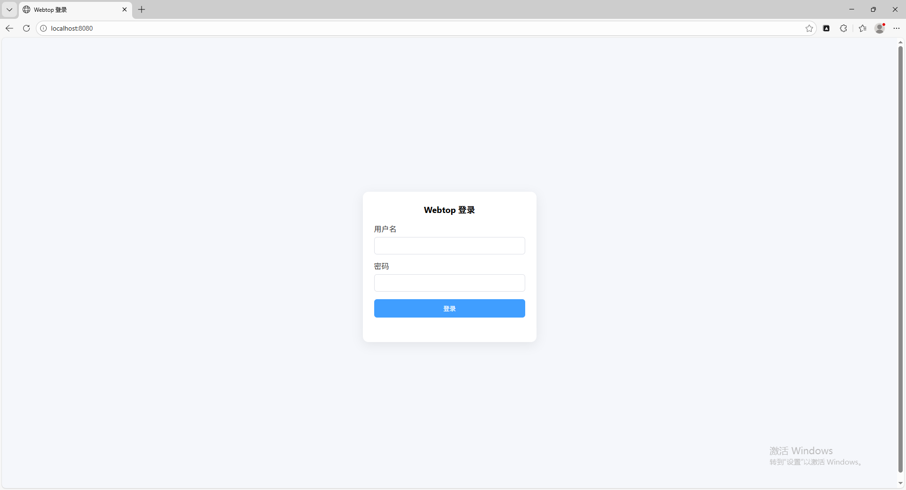
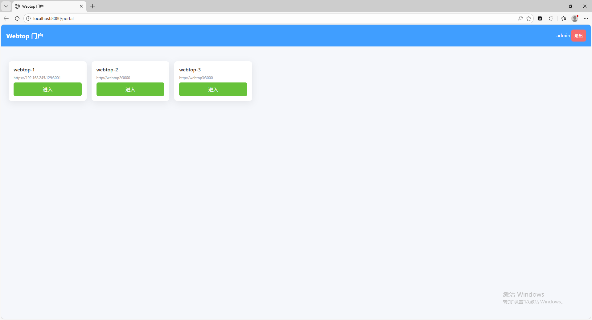
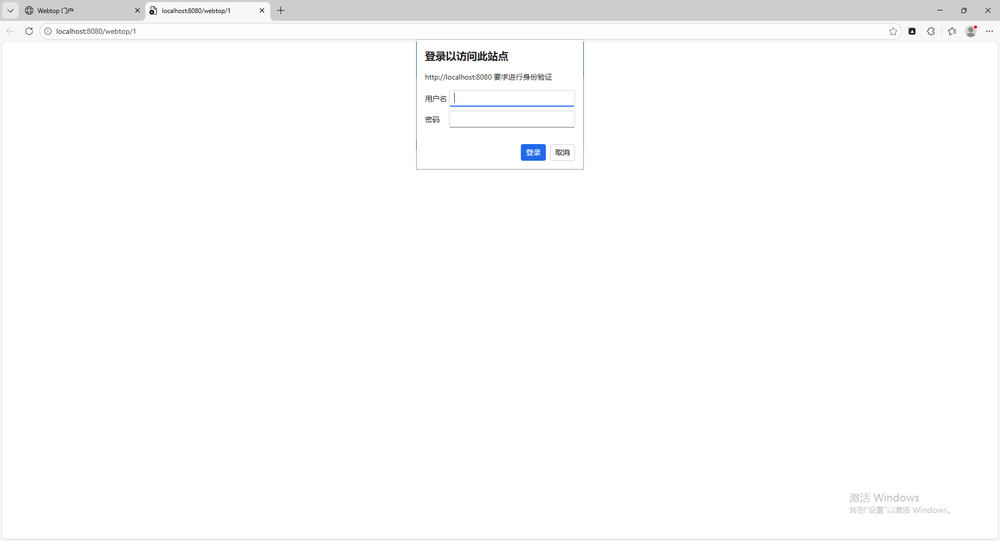
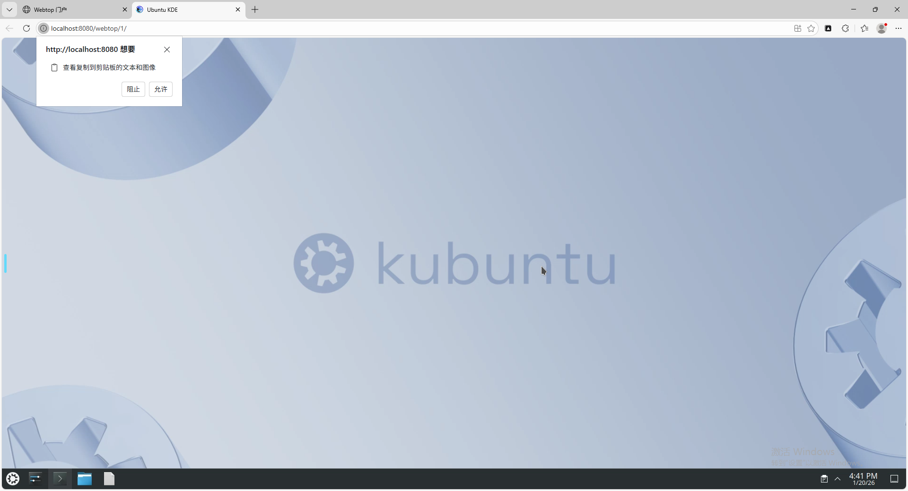
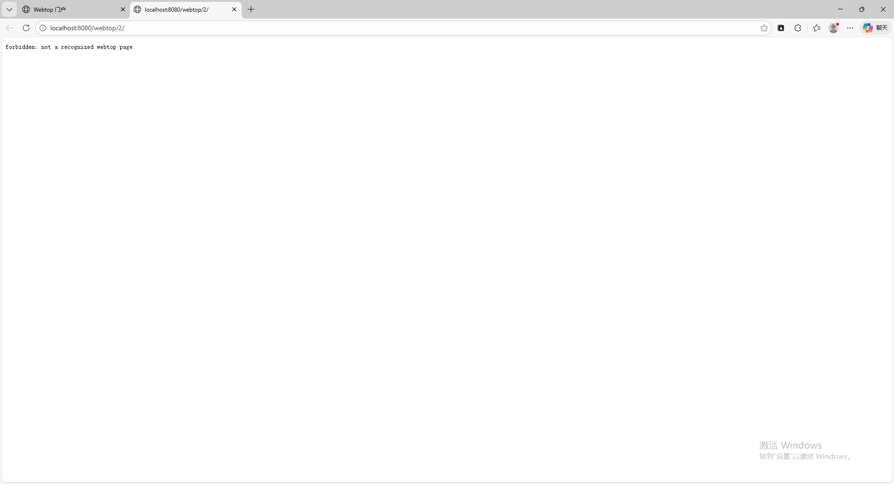

**Security Warning: This project is not security-hardened. Do NOT expose it directly to the public internet without an audit, hardening, and your own threat model.**
**Proxy Restriction: This gateway only intends to proxy Webtop. Other targets will be rejected automatical by inner rule.**

# Webtop User Center

Webtop is a great browser-based desktop, but it ships without a lightweight user/admin portal. This project adds a GoFrame-based portal plus an embedded tunnel reverse-proxy so you can:

- Authenticate users, lock out brute-force logins, and manage accounts.
- Configure Webtop targets and jump to them from a simple portal.
- Reverse-proxy HTTP/WebSocket traffic through a client-side agent when Webtop is inside a LAN.

## Screenshots

- Login: `docs/01login.png` (locks after 3 wrong password attempts; lock duration grows, up to 1 year).
- Portal home: `docs/02index.png`.
- Webtop config: `docs/03setting.png`.
- Webtop Login: `docs/04proxy.png`.
- Webtop in use: `docs/05success.png`.

## Features

- User auth with session cookie; IP/account lockout after 3 failures (progressive backoff).
- Admin UI (HTML/JS via GoFrame templates) to manage users and Webtops (create/update/delete, enable toggle).
- Portal UI lists a user’s accessible Webtops and links into each.
- Reverse proxy for HTTP/WebSocket to Webtop; supports LAN-only Webtops via a client→server tunnel. It is **not** a general-purpose reverse proxy.
- Optional tunnel TLS (self-signed supported); toggle upstream TLS verification with `PROXY_INSECURE`.
- Default admin bootstrap (`admin` / `admin123`) created on first run; change immediately.
- Source: https://github.com/2018yuli/cas

## Architecture

- Server (`cmd/server`): hosts portal + reverse proxy; listens on HTTP/HTTPS; consumes tunnel connections sent from clients.
- Client (`cmd/client`): runs near the Webtop targets; establishes outbound tunnel connections to server; proxies traffic to the actual Webtop URLs.
- Tunnel: simple TCP (optional TLS) with per-request target forwarding. Each request grabs a tunnel connection and sends the target URL; client dials the target and pipes bytes (HTTP/WebSocket supported).
- **Current scope:** single client pool. The tunnel does not tag client identity, and there is no Webtop→client routing; it's effectively one client. Multi-client would require adding client IDs in handshake + per-Webtop routing.

## Quick start (dev/demo)

1. **Generate a self-signed cert** (optional, for tunnel TLS):
   ```bash
   go run cmd/utils/gen_cert.go -cert tunnel-cert.pem -key tunnel-key.pem -cn localhost -days 365
   ```
2. **Edit configs** (`cmd/server/config.toml`, `cmd/client/config.toml`):
   - Set `tunnel.secret` identical on both sides.
   - Server: `server_addr=0.0.0.0`, `data_port` for tunnel; set `tls_enabled=true` and paths to cert/key if you want TLS.
   - Client: `server_addr=<server-public-ip>`, same `data_port`; `tls_enabled`/`tls_insecure` to match server.
   - Adjust `conn_count` (default 4) if you expect many concurrent WebSocket sessions.
3. **Run client first** (from repo root):
   ```bash
   CONFIG_FILE=cmd/client/config.toml go run cmd/client
   ```
4. **Run server**:
   ```bash
   CONFIG_FILE=cmd/server/config.toml go run cmd/server
   ```
5. **Login** at `http://localhost:8080/` (default admin `admin` / `admin123`), then create users and Webtop entries (e.g., `https://192.168.x.x:3001`).

## Notes and limitations

- Tunnel is minimal by design; no multiplexing/authz beyond the shared secret. Harden before production.
- Upstream TLS verification: default is disabled (`PROXY_INSECURE=true`) to tolerate self-signed Webtops; set it to false and provide `PROXY_CA_FILE` for real certs.
- Change default credentials immediately and restrict network exposure (firewalls/VPN). There is no guarantee of security.\*\*\*

## License

Apache-2.0 (see `LICENSE`). Please keep attribution to 2018yuli/cas and contributors.

## UI Preview







